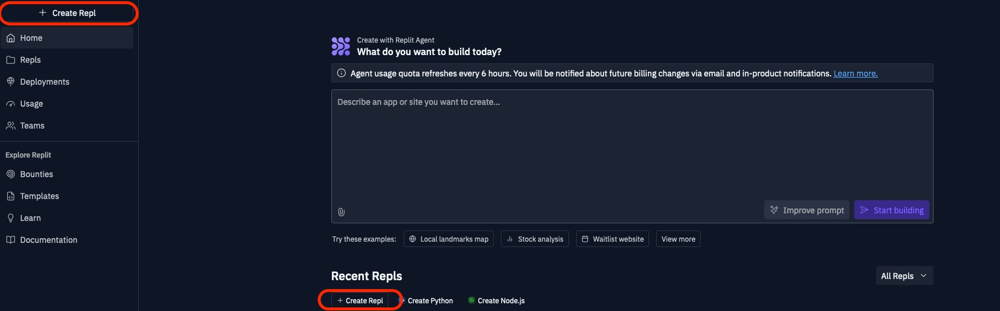
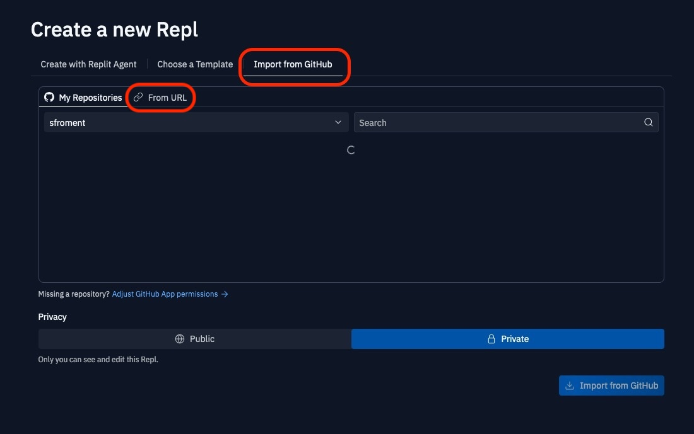
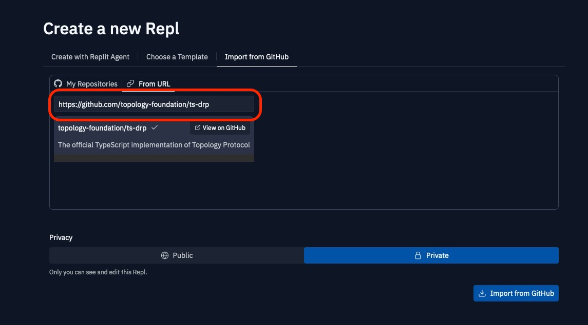
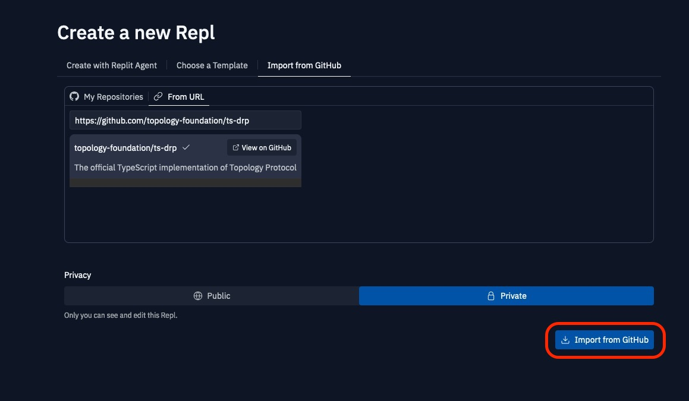
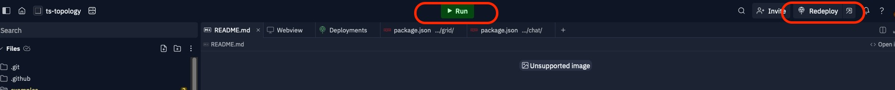

# Replit

## How to run on Replit

1. Go to [Replit](https://replit.com/~)
2. Click on `Create a Repl`

3. Click on `Import from GitHub`

4. Enter `https://github.com/topology-foundation/ts-drp` in the `GitHub repository` field (you can also connect your GitHub account and select the repository from there)

5. Click on `Import from GitHub`

1. Run or Deploy the Repl

